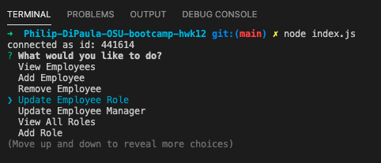
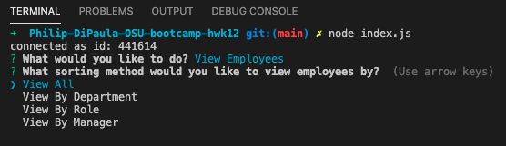
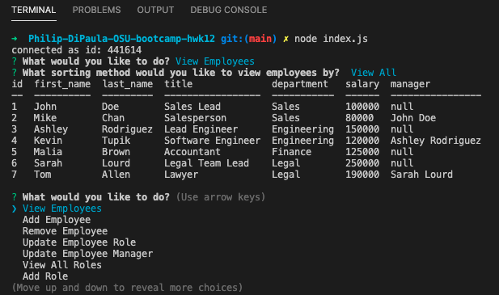

# Philip-DiPaula-OSU-bootcamp-hwk12

## These are the files for the homework assignment associated with section 12 of the OSU Web Development Bootcamp

* Here is a link to the [github](https://github.com/pjdip/Philip-DiPaula-OSU-bootcamp-hwk12)

The goal of this assignment was to build an application that can be used to create, read, update, and delete (CRUD) employees/roles/departments in a [mysql](https://www.mysql.com/downloads/) database using the [Inquirer package](https://www.npmjs.com/package/inquirer) to construct the user interface in [node.js](https://nodejs.org/en/download/). Employee data is stored in and retrieved from a mysql database using the [mysql package](https://www.npmjs.com/package/mysql) and the SQL query language.

* [Installation](#installation)
* [Usage](#usage)
* [Credits](#credits)
* [Badges](#badges)
* [License](#license)

## Installation

Installation requirements include node.js, inquirer.js, mysql, and the mysql npm package.
You will find package dependency .json files in the github repo that should allow inquirer and mysql packages to work without any further effort on your end. You will need to install node and mysql on your own. Installation options for node can be found [here](https://nodejs.org/en/download/). Installation options for mysql can be found [here](https://www.mysql.com/downloads/)

## Usage 

In order to use this application, first clone the repo to your local machine. Then use the command line to navigate to the main folder containing index.js. Once you have node and mysql installed, you should be able to start the application using the command 'node index.js'. If you are successful, you will be prompted to choose which action you would like to take from a list of options. If you have any troubles running the application, try doing 'npm install' from the main folder and then try again.

Once you are presented with the list of options, you will be able to make changes to the database, view the contents of the database, or exit the program. The database consists of 3 different tables. The first table contains the names of all departments in the company. You will have the option to view all of the departments, add a new department to the table, remove a department from the table or view the budget of a department (in our context, the budget is calculated by adding together the salaries of every member in the department). The second table is the roles table. This lists every job title, the salary for that job title, and the department to which that job belongs. It is possible to view all of the roles in the table, as well as add/remove roles to/from the table. The final, and most complex table in the database is the employee table. Each Employee is assigned a first and last name, as well as the role (or job title) they will play in the company and a manager (another employee). Users will be able to view the employee table in a number of ways, either viewing the entire table, or sorting by department/role/manager to view specific employees. Users will also be able to add/remove employees to/from the table. Existing employees can have their role or manager updated as well. Once the user has chosen an action and completed the task, they will be returned to the main menu, where they may perform more tasks or exit the program. View the tutorial below for any questions you may have about functionality.

Here are some screenshots:

Main Menu: 
Employee Viewing Options: 
Table Display Example: 

Here is a link to a video [walkthrough]()

## Credits

Special Thanks to Inquirer.js documentation:
* [docs](https://www.npmjs.com/package/inquirer)
* [examples](https://github.com/SBoudrias/Inquirer.js)

Special Thanks to mysql documentation:
* [npm](https://www.npmjs.com/package/mysql)
* [password reset](https://dev.mysql.com/doc/refman/8.0/en/set-password.html)
* [decimal syntax](https://dev.mysql.com/doc/refman/5.7/en/precision-math-decimal-characteristics.html)
* [foreign keys](https://dev.mysql.com/doc/mysql-tutorial-excerpt/5.7/en/example-foreign-keys.html)
* [more foreign keys](https://www.mysqltutorial.org/mysql-foreign-key/)
* [inner join](https://www.mysqltutorial.org/mysql-inner-join.aspx/)
* [self-join](https://www.mysqltutorial.org/mysql-self-join/)

Thanks to w3schools for some clarification on [joins](https://www.w3schools.com/sql/sql_join.asp)

[console.table](https://www.npmjs.com/package/console.table)

Special Thanks to [ChilledCow](https://www.youtube.com/channel/UCSJ4gkVC6NrvII8umztf0Ow) for providing chill lofi beats to code to

## Badges

## License

Licensed under the [GNU General Public License v3.0](https://choosealicense.com/licenses/gpl-3.0/)

---